# 3-JOB CI/CD PIPELINE WITH JENKINS

- [3-JOB CI/CD PIPELINE WITH JENKINS](#3-job-cicd-pipeline-with-jenkins)
  - [Overview](#overview)
    - [Why the Pipeline Is Designed This Way](#why-the-pipeline-is-designed-this-way)
      - [Separation of Concerns](#separation-of-concerns)
      - [Use of Jenkins Master + Agents](#use-of-jenkins-master--agents)
      - [SSH-Based Authentication](#ssh-based-authentication)
    - [Benefits Observed](#benefits-observed)
  - [Pre-requisites](#pre-requisites)
    - [Add SSH key to GitHub repository and Jenkins](#add-ssh-key-to-github-repository-and-jenkins)
    - [Store .pem key in Jenkins](#store-pem-key-in-jenkins)
    - [Add GitHub Webhook](#add-github-webhook)
  - [Job-1: CI with GitHub Webhook](#job-1-ci-with-github-webhook)
    - [How to create Job-1](#how-to-create-job-1)
  - [Job-2: CI Merge the code from `dev/` branch to `main/` branch](#job-2-ci-merge-the-code-from-dev-branch-to-main-branch)
    - [How to create Job-2](#how-to-create-job-2)


## Overview

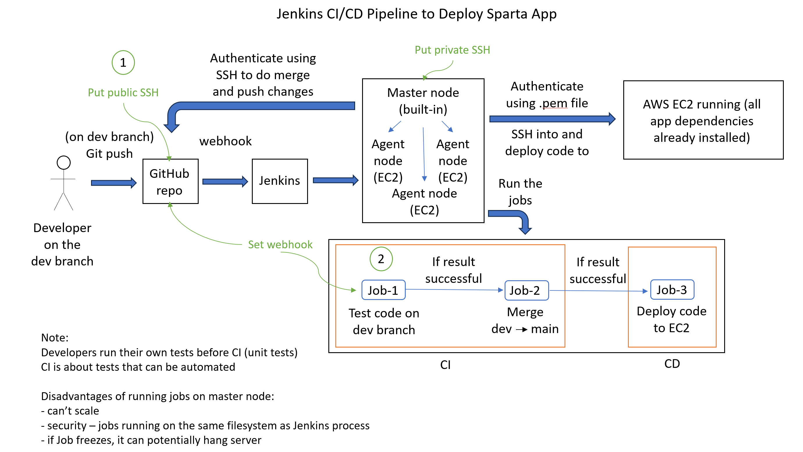

This pipeline is designed to automate the process of testing, integrating, and deploying application code from a `dev branch` to production infrastructure hosted on `AWS EC2`.

**It follows a standard CI → CD flow:**

- CI (Continuous Integration)
  - Validate and merge code.
- CD (Continuous Deployment)
  - Deploy validated code automatically to a live environment.

### Why the Pipeline Is Designed This Way

#### Separation of Concerns

The pipeline is split into three sequential jobs:

1. Test (Job-1)
2. Merge (Job-2)
3. Deploy (Job-3)

**This ensures:**

- Fault isolation (fail early, do not proceed)
- Clear responsibility per stage
- Easier debugging and maintenance

#### Use of Jenkins Master + Agents

- Master node: orchestrates jobs
- Agent nodes (EC2): execute jobs

**This design is used because:**

- Improves scalability (jobs distributed across agents)
- Improves security (isolated execution environments)
- Prevents master node overload or failure

#### SSH-Based Authentication

**SSH is used for:**

- GitHub access (secure repo interaction)
- EC2 access (secure deployment)

**Reasons:**

- Key-based authentication is more secure than passwords
- Enables automation without manual intervention
- Industry standard for CI/CD pipelines

### Benefits Observed

**Technical Benefits**
- Bugs are found early
- No need to deploy manually
- Same process every time
- Faster releases

**Operational Benefits**
- Lower risk of downtime
- Easy to track what was deployed
- Easier to roll back using Git

**Benefits for an Organisation**
- Developers work more efficiently
- More confidence in releases
- Same workflow across teams
- Easier to scale projects

## Pre-requisites

### Add SSH key to GitHub repository and Jenkins

1. Generate SSH key-pair  

   **Bash:**
`ssh-keygen -t rsa -b 4096 -C "nveselova@spartaglobal.com"`

2. Then open the file and copy its contents:

```bash
cat <your-key>
```

3. Create a repository on GitHub and locally
4. Add your generated PUBLIC SSH key (`.pub`) to GitHub repository  
- On GitHub repository go to Settings → Deploy keys → Choose **Allow write access** → Add key

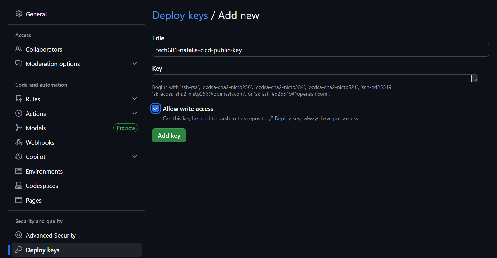

5. Store private key in Jenkins:

    Jenkins → Credentials → Add Credentials  
    Type: SSH Username with PRIVATE key 

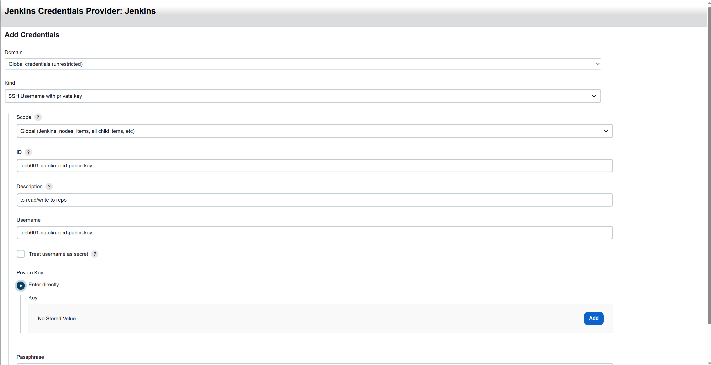
  
6. In a local repo directory
   1. Enable ssh-agent

    ```bash
      eval `ssh-agent -s`
    ```
    2. Add your PRIVATE SSH key to the agent

    ```bash
    ssh-add ~/.ssh/<private key name>
    ```
    3. Test the connection
   
   ```bash
   ssh -T git@github.com
   ```
    4. Connect to the GitHub repository
   
   ```bash
   git remote add origin git@github.com: ...
   ```

### Store .pem key in Jenkins

### Add GitHub Webhook

- Inside the GitHub repository → Webhooks

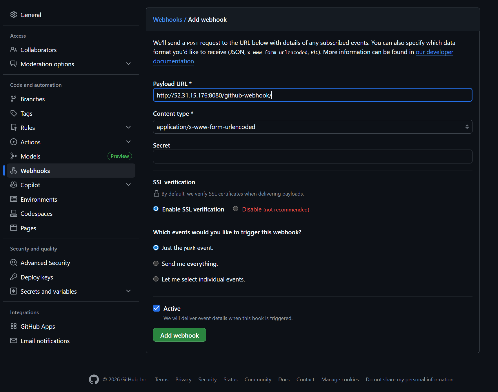

## Job-1: CI with GitHub Webhook

**Purpose**

- Validate code before integration.

**Trigger**  
- Automatically triggered by **webhook** on `push` to `dev` branch

**Steps**
1. Pull latest code from dev
2. Install dependencies
3. Run automated tests  
 
---
### How to create Job-1

1. Create New Job  

Open Jenkins dashboard → Click New Item → Enter name: `natalia-job1-ci-test` → Select Freestyle project → Click OK

2. Go to Configure → General

- give the job a Description
- **Discard Old Builds** automatically deletes old build records and artefacts
- **GitHub Project URL** is the web address of the repository  
    `https://github.com/NatVes/tech601-cicd-sparta-app.git`

    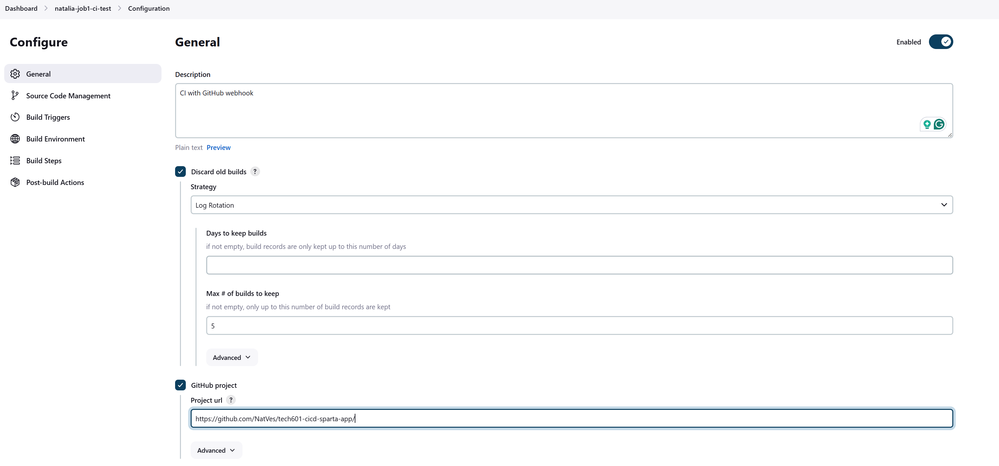

3. Configure → Source Code Management

- choose **Git**
- **Repository URL** is the address Jenkins uses to clone or pull your code  
    `git@github.com:NatVes/tech601-cicd-sparta-app.git`
- Credentials:  
    Select your stored SSH key (GitHub access)
- Branches to build:  
    Restrict to `*/dev` branch

    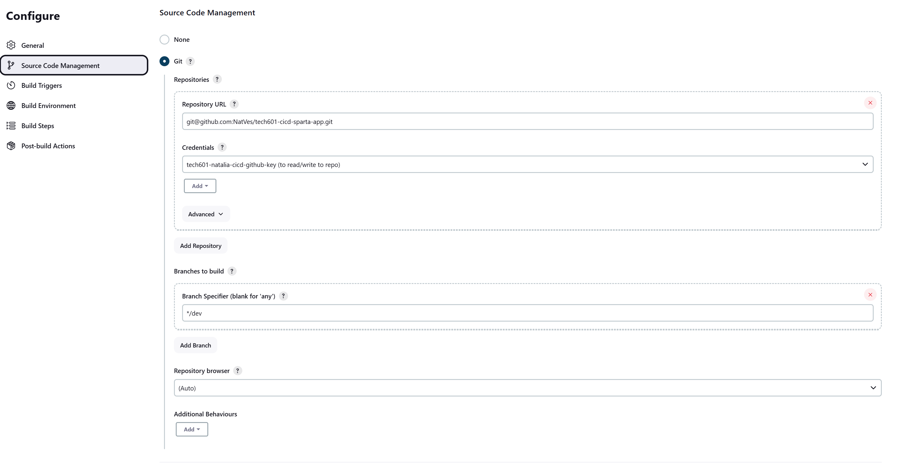

4. Configure → Build Triggers (Webhook)

    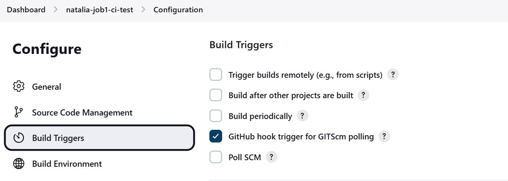

5. Configure → Build Environment
   - Provide Node & npm bin/ folder to PATH → NodeJS v.20

    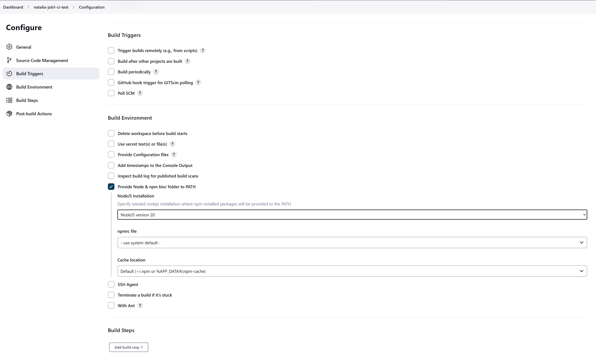

6. Configure → Build Steps
    - Add build step → add code to run tests
  
        ```bash
        cd app
        npm install
        npm test
        ```

    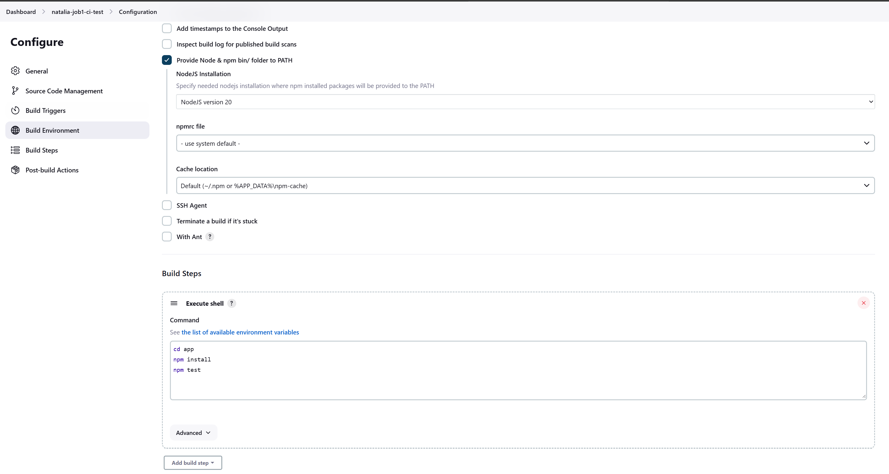

7. Post-build Actions
    - Add: **Build other projects**
    - Enter the name of Job 2: `natalia-job2-ci-merge
    - Tick: **Trigger only if build is stable**

    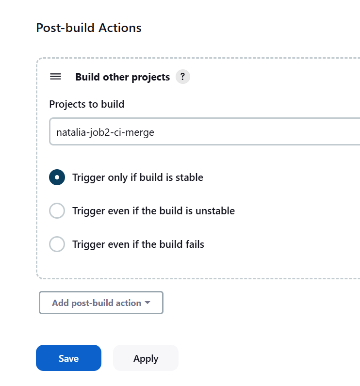

8. Save

## Job-2: CI Merge the code from `dev/` branch to `main/` branch

**Job-2** (CI Merge) is triggered automatically by **Job-1** after successful tests.
It merges code from the `dev` branch into the `main` branch and pushes the updated main to GitHub.

### How to create Job-2

1. Create Job-2

   - Create a new Freestyle project and name it something like: `natalia-job2-ci-merge`
   - **Use Job-1 as a template**

2. In Source Code Management
    - Branch to build → change to `*/main`

    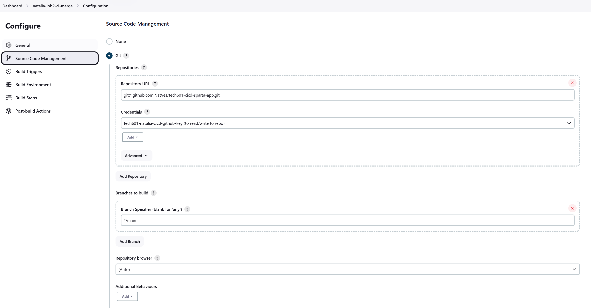

3. Build Triggers
   - Do not add a webhook trigger here
   - Job-2 should be triggered by Job-1, not directly by GitHub

    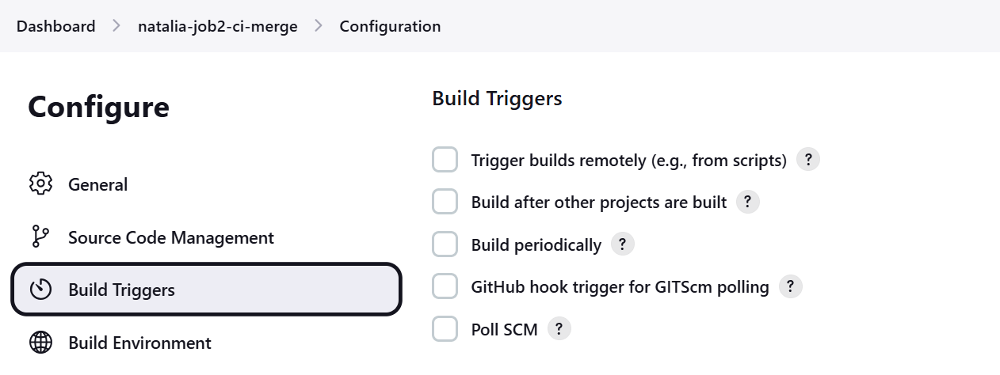

4. Build Environment  
    **Tick:**   
     - Delete workspace before build starts
       > this deletes all files from the previous build before starting a new one
     - SSH Agent
       > Loads your SSH private key (stored in Jenkins credentials)  
        Makes it available to Git during the build  
        Allows secure, automated authentication

    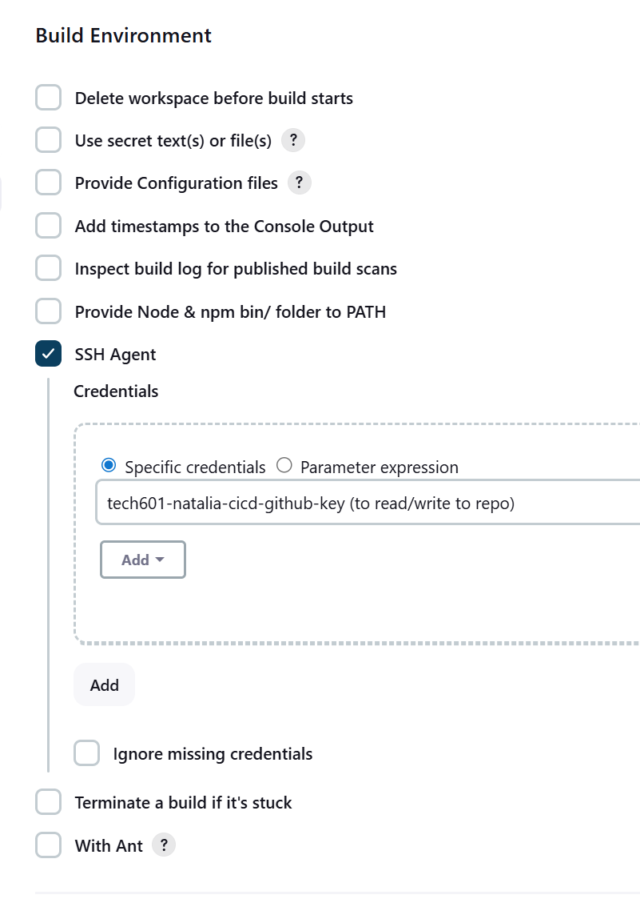

5. Build Steps

    **Add Execute shell and use:**

    ```bash
    git checkout main
    git pull origin main
    git fetch origin dev
    git merge origin/dev
    git push origin main
    ```
    **This makes:**

    - check out `main`
    - get the latest changes
    - merge `dev` into `main`
    - push the updated `main` branch to GitHub

    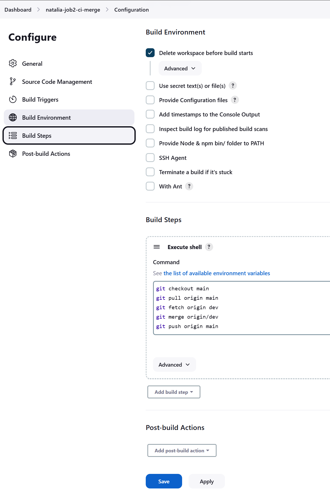


