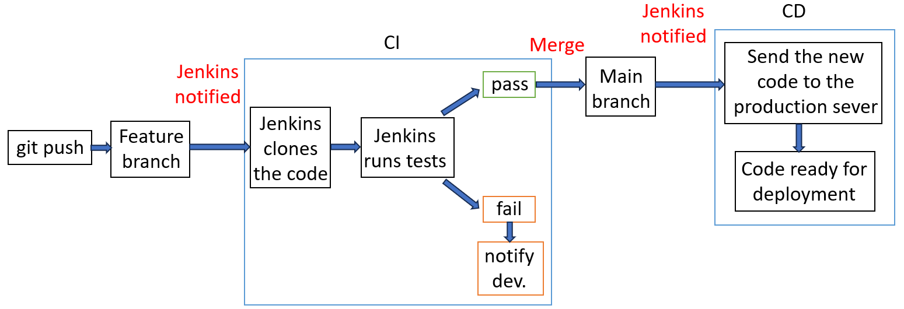

# CI/CD (Continuous Integration / Continuous Deployment)

- [CI/CD (Continuous Integration / Continuous Deployment)](#cicd-continuous-integration--continuous-deployment)
  - [1. Continuous Integration (CI)](#1-continuous-integration-ci)
    - [Benefits of CI](#benefits-of-ci)
  - [2. Continuous Delivery (CD)](#2-continuous-delivery-cd)
    - [Benefits of Continuous Delivery](#benefits-of-continuous-delivery)
    - [Difference between CD and CDE](#difference-between-cd-and-cde)
  - [What is Jenkins?](#what-is-jenkins)
    - [Why use Jenkins?](#why-use-jenkins)
    - [Benefits of Jenkins](#benefits-of-jenkins)
    - [Disadvantages of Jenkins](#disadvantages-of-jenkins)
    - [Stages of Jenkins](#stages-of-jenkins)
    - [Jenkins core concepts](#jenkins-core-concepts)
    - [What is an artefact?](#what-is-an-artefact)
    - [Alternatives to Jenkins](#alternatives-to-jenkins)
  - [Why build a pipeline? Business value](#why-build-a-pipeline-business-value)
    - [Main business benefits:](#main-business-benefits)
  - [SDLC workflow](#sdlc-workflow)
  - [Webhooks](#webhooks)
    - [Webhooks (general concept)](#webhooks-general-concept)
    - [Webhooks in Jenkins](#webhooks-in-jenkins)
    - [Webhooks in GitHub Actions](#webhooks-in-github-actions)


## 1. Continuous Integration (CI)

It is the practice of merging code changes into a shared repository frequently and then automatically running checks such as build, unit tests, linting and basic security checks. The aim is to detect integration problems early, while changes are still small and easier to fix.

### Benefits of CI

- Finds defects early
- Reduces “it works on my machine” issues (differences in environment (OS, Node/Python version), dependencies, configuration or environment variables)
- Gives faster feedback to developers
- Improves code quality and consistency
- Makes releases less risky because the codebase stays in a releasable state more often

## 2. Continuous Delivery (CD)

CD usually means Continuous Delivery in most contexts.  
That means changes that pass the pipeline are kept in a deployable state, and the release to production is usually a business decision or manual approval step.  
Jenkins describes a CD pipeline as an automated path from version control through testing and deployment stages.

### Benefits of Continuous Delivery

- Faster, more predictable releases.
- Lower release risk.
- Better test automation and traceability.
- Easier rollback and change control.
- Business can choose when to release without a scramble.

>Continuous Delivery / Deployment (CD) helps the **Operations team** by making releases **safer, faster and more predictable**.

### Difference between CD and CDE

There is no single standard DevOps acronym “CDE” in the same way there is for CI/CD. In most real conversations, people usually mean one of these:

>CD = Continuous Delivery   
>CDE = Continuous Deployment.

**Continuous Delivery:** the software is always ready to release, but production release may still require manual approval.
**Continuous Deployment:** every change that passes the pipeline is automatically released to production.

## What is Jenkins?

Jenkins is an open-source automation server. Its official site describes it as a leading open-source automation server with hundreds of plugins for building, deploying and automating projects. It can act as a CI server or a broader continuous delivery hub.

Jenkins is used to automate repetitive software delivery tasks such as:

- pulling code from source control,
- building the application,
- running tests,
- publishing artefacts,
- deploying to environments,
- triggering approvals or downstream jobs.

### Why use Jenkins?

- Automation  
Runs build, tests and deployment automatically after code changes.
- Flexibility  
You can customise pipelines for almost any workflow.
- Works with many tools  
Integrates with Git, Docker, Kubernetes and others.
- Scalable  
Can run jobs on multiple machines (agents) in parallel.
- Full control  
You host it yourself and control the environment.
- Pipeline as code  
Pipelines are written in code (Jenkinsfile) and stored in the repository.

### Benefits of Jenkins 

- Open source and widely adopted.
- Huge plugin ecosystem.
- Pipeline as code with Jenkinsfile.
- Distributed builds using agents/nodes.
- Flexible enough for simple CI and complex release flows.
- Auditability and versioning when pipeline definitions are stored in source control.

### Disadvantages of Jenkins

- Too many plugins can make Jenkins harder to manage.
- Updating Jenkins and plugins can cause compatibility issues.
- You have to manage everything yourself (security, backups, scaling).
- The interface and setup can feel outdated or inconsistent.
- Complex pipelines can become difficult to control without clear standards.

The first two advantages come directly from Jenkins documentation.
The disadvantages are not official statements — they are practical issues that happen because Jenkins is self-hosted and relies on many plugins.

### Stages of Jenkins

Strictly speaking, Jenkins itself does not force one universal stage model. 

>In Pipeline, a stage is a logical section such as Build, Test or Deploy. The Jenkins docs use Build, Test and Deploy as a standard example.

A common general pipeline in Jenkins is:

- Checkout / Source (scm - source code management)   
Get the code from the repository (e.g. Git).
- Build  
Compile or prepare the application.
- Test  
Run automated tests to check functionality.
- Package  
Create a deployable version (e.g. .jar, dist/, Docker image).
- Publish artefact  
Store the build output in a repository (e.g. Nexus, Artifactory).
- Deploy to non-production  
Deploy to dev or staging environment for testing.
- Approval / gates  
Manual or automated check before production (e.g. approval, quality checks).
- Deploy to production  
Release the application to live users.
- Post-deployment checks / notifications  
Monitor, run checks, send alerts or reports.

### Jenkins core concepts
- Pipeline  
The whole CI/CD process.
- Node  
A machine (agent) where the pipeline runs.
- Stage  
A logical step (e.g. Build, Test).
- Step  
A single action inside a stage (e.g. run command).

### What is an artefact?

An artefact is a build output produced by the pipeline and stored for later use. 

Examples
- compiled code (.jar, .exe)
- frontend build (dist/, build/)
- Docker image
- zip archive 

GitHub Actions documentation explicitly refers to workflow artefacts, and Jenkins documentation refers to the built software progressing through testing and deployment stages.

### Alternatives to Jenkins

Common alternatives include:

- GitLab CI/CD: An integrated part of GitLab, offering native CI/CD with simpler configurations.
- CircleCI: A cloud-based CI tool that focuses on fast builds and ease of use.
- Travis CI: A hosted CI/CD tool integrated with GitHub, providing straightforward CI/CD services.
- Bamboo: A CI/CD server from Atlassian, tightly integrated with JIRA and Bitbucket.
- TeamCity: A JetBrains product offering robust CI/CD capabilities with a strong focus on enterprise use.
- GitHub Actions: GitHub's native CI/CD solution, allowing workflows directly in repositories.
- GoCD: An open-source tool designed for automating and managing continuous delivery pipelines.
- Azure Pipelines

Among the mainstream integrated platforms, GitHub Actions, GitLab CI/CD and Azure Pipelines are well-established options with built-in CI/CD documentation and hosted runner models.

## Why build a pipeline? Business value

A pipeline is not just a technical convenience. It provides business value by making delivery faster, more repeatable and less risky.

### Main business benefits:

- Shorter time to market.
- Lower cost of defects because issues are caught earlier.
- More reliable releases through standardised automated checks.
- Better productivity because engineers spend less time on manual release work.
- Traceability and compliance through logs, approvals and repeatable steps.
- Scalability as teams and systems grow.


*Jenkins Automation diagram*

## SDLC workflow

SDLC (Software Development Life Cycle) workflow is the process of how software is planned, built, tested and released.

A simplified SDLC flow is:

**Plan → Design → Develop → Test → Deploy → Operate/Monitor → Improve**

**Typical SDLC stages**  
- Plan  
Define requirements and goals.
- Design  
Create system architecture and design.
- Develop  
Write the code.
- Test  
Check that the software works correctly.
- Deploy  
Release the application.
- Maintain  
Fix bugs and improve the system.

**How it connects to CI/CD:**

- Plan / Design: define requirements, architecture and acceptance criteria.
- Develop: write code and tests.
- CI: automatically build and validate every change.
- CD: package and move validated changes through environments.
- Deploy / Operate: release, monitor and feed learning back into planning.

## Webhooks

### Webhooks (general concept)

A webhook is a mechanism where one system automatically sends an HTTP request to another system when a specific event occurs.

- It is event-driven (not polling).
- Usually sent as an HTTP POST request with a JSON payload.
- Requires a predefined URL (endpoint) to receive the data.

**Example:**

>A payment service sends a webhook to your server when a transaction is completed.  
>A repository sends a webhook when code is pushed.

### Webhooks in Jenkins

In Jenkins, webhooks are typically used to trigger jobs automatically.

**Common use case:**

>A Git repository sends a webhook to Jenkins when code is pushed.  
>Jenkins receives the event and starts a build pipeline.

**How it works:**

1. You configure a Jenkins job (e.g. pipeline)
2. You expose a webhook endpoint (often via plugins like GitHub Integration)
3. The repository sends an HTTP request to Jenkins
4. Jenkins triggers the build

**Example flow:**

>Developer pushes code → webhook sent → Jenkins builds, tests, deploys.

**Why it matters:**

- Eliminates manual triggering
- Enables continuous integration (CI)

### Webhooks in GitHub Actions

In GitHub Actions, webhooks are **built-in and abstracted as events**.

You do not manually handle webhook endpoints in most cases. Instead, you **define workflows** that react to events.

**Example events:**

- push
- pull_request
- release
- issue_comment

**Example workflow trigger:**
```yaml
on:
  push:
    branches: [main]
```

**What happens internally:**

1. GitHub generates an event (internally similar to a webhook)
2. GitHub Actions listens to that event
3. The workflow is triggered automatically

**Key difference from Jenkins:**

- Jenkins: you configure webhook endpoints manually. 
- GitHub Actions: event system is integrated; no external webhook setup needed.


http://52.31.15.176:8080/  
username: devopslondon  
password: DevOpsAdmin

scp -o StrictHostKeyChecking=no -r app ubuntu@108.130.111.154:/home/ubuntu/
ssh -o StrictHostKeyChecking=no ubuntu@108.130.111.154 << EOF
sudo rm -rf /tech601-sparta-app/app
sudo mv /home/ubuntu/app /tech601-sparta-app/
cd /tech601-sparta-app/app
npm install
pm2 delete sparta-app || true
pm2 start app.js --name sparta-app
EOF


